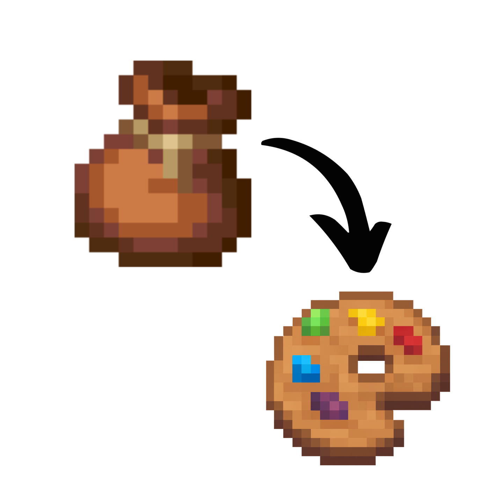

# Bundle In Palette

<p align="center">
  
</p>

Bundle In Palette adds sixteen dyed variants of the vanilla bundle so you can color-code your inventory and storage.  
This mod **requires [Bundle In Creative](https://github.com/dmor-me/BundleInCreative)** (or any mod that restores the vanilla bundle recipe) so the new dyes have something to tint.

## Features
- 16 bespoke bundle textures covering every vanilla dye color.
- Shapeless recipes: combine one vanilla bundle with any dye to recolor it.
- Automatically injected into the Tools & Utilities creative tab.
- All bundles (vanilla + dyed) share the `forge:bundles` item tag for compatibility.
- Target platform: Minecraft **1.20.1** / Forge **47.x**.

## Crafting
```
Bundle + Any Dye -> Matching Dyed Bundle
```
Recipes unlock once you obtain at least one vanilla bundle.

## Installation
1. Install Minecraft Forge 1.20.1 (47.x line).
2. Download the latest releases of:
   - [Bundle In Creative](https://github.com/dmor-me/BundleInCreative/releases)
   - Bundle In Palette (this repository’s Releases tab).
3. Drop both `.jar` files into your Minecraft `mods` folder.
4. Launch Minecraft using the Forge profile.

## Developing / Building
```bash
git clone https://github.com/dmor-me/BundleInPalette.git
cd BundleInPalette/BundleInPalette
./gradlew build
```
Artifacts are produced in `BundleInPalette/BundleInPalette/build/libs/`.

## License
This project is released under the MIT License. See [`LICENSE`](LICENSE) for details.

## Credits & Links
- **dmor-me** – concept, textures, and mod author.
  - Bundle In Palette repo: <https://github.com/dmor-me/BundleInPalette>
  - Bundle In Creative repo: <https://github.com/dmor-me/BundleInCreative>
  - Shared issue tracker: <https://github.com/dmor-me/BundleInCreative/issues>

Enjoy organizing your palettes!

<p align="center">
  
</p>
